# Refactor decimal aggregation device calls to use type_dispatcher

## Current state

### Deserialize path (line 109)

In [`DecimalAggregationState.cpp`](velox/experimental/cudf/exec/DecimalAggregationState.cpp) (lines 83–117), deserialize manually inspects the strings offsets type, sets `offsets64`, and casts `offsetsView.data<int64_t>()` / `data<int32_t>()` to `void*` before calling the device helper.

The device implementation in [`DecimalAggregationDevice.cu`](velox/experimental/cudf/exec/DecimalAggregationDevice.cu) already has fully typed kernels (`launchUnpackState<OffsetT>`); the `bool` + `void*` wrapper (lines 309–337) is redundant type erasure.

### Serialize path (lines 187 and 207)

The serialize path uses offset type-erasure for both `fillOffsetsForDecimalSumState` and `packDecimalSumState`, and additionally erases sum types via `sumType` + `sumPtr`:

```187:215:velox/experimental/cudf/exec/DecimalAggregationState.cpp
  detail::fillOffsetsForDecimalSumState(
      useLargeOffsets,
      useLargeOffsets ? static_cast<void*>(offsetsView.data<int64_t>())
                      : static_cast<void*>(offsetsView.data<int32_t>()),
      rowCount,
      stream);
  ...
  const void* sumPtr = sumType == cudf::type_id::DECIMAL64
      ? static_cast<const void*>(sumCol.data<int64_t>())
      : static_cast<const void*>(sumCol.data<__int128_t>());
  detail::packDecimalSumState(
      sumType,
      useLargeOffsets,
      sumPtr,
      countCol.data<int64_t>(),
      offsetsPtr,
      charsPtr,
      rowCount,
      stream);
```

`useLargeOffsets` is still needed to **choose** `offsetsType` when creating the offsets column (lines 172–179), but it should no longer be threaded into device calls or used for pointer casts.

The device wrappers `fillOffsetsForDecimalSumState` (lines 237–253) and `packDecimalSumState` (lines 255–307) mirror the unpack problem: typed kernels (`launchFillOffsets<OffsetT>`, `launchPackState<SumT, OffsetT>`) exist, but the public API erases types via `bool`/`type_id` + `void*`.

### Average path (lines 257–265)

`computeDecimalAverage` applies the same sum-type erasure pattern:

```257:265:velox/experimental/cudf/exec/DecimalAggregationState.cpp
    const auto sumType = sumCol.type().id();
    const void* sumsPtr = sumType == cudf::type_id::DECIMAL64
        ? static_cast<const void*>(sumCol.data<int64_t>())
        : static_cast<const void*>(sumCol.data<__int128_t>());
    void* outPtr = sumType == cudf::type_id::DECIMAL64
        ? static_cast<void*>(out->mutable_view().data<int64_t>())
        : static_cast<void*>(out->mutable_view().data<__int128_t>());
    detail::averageRoundDecimalSum(
        sumType, sumsPtr, countCol.data<int64_t>(), outPtr, rowCount, stream);
```

The device wrapper `averageRoundDecimalSum` (lines 339–362) branches on `sumType` and casts to typed spans for `launchAvgRound<SumT>`.

There is **no existing `type_dispatcher` usage** in `velox/experimental/cudf/` today — this will be the first adoption in this module.

## Target design

```mermaid
flowchart TB
  subgraph deserialize [deserializeDecimalSumState]
    dOffsets["strings.offsets()"]
    dDispatch["type_dispatcher(offsetsView.type())"]
    dUnpack["unpackDecimalSumState&lt;OffsetT&gt;"]
    dKernel["launchUnpackState&lt;OffsetT&gt;"]
    dOffsets --> dDispatch --> dUnpack --> dKernel
  end

  subgraph serialize [serializeDecimalSumState]
    sOffsets["offsetsCol mutable_view"]
    sFillDispatch["type_dispatcher(offsetsView.type())"]
    sPackDispatch["double dispatch sum + offset types"]
    sFill["fillOffsetsForDecimalSumState&lt;OffsetT&gt;"]
    sPack["packDecimalSumState&lt;SumT,OffsetT&gt;"]
    sFillKernel["launchFillOffsets&lt;OffsetT&gt;"]
    sPackKernel["launchPackState&lt;SumT,OffsetT&gt;"]
    sOffsets --> sFillDispatch --> sFill --> sFillKernel
    sOffsets --> sPackDispatch --> sPack --> sPackKernel
  end

  subgraph average [computeDecimalAverage]
    aSum["sumCol.type()"]
    aDispatch["type_dispatcher&lt;dispatch_storage_type&gt;"]
    aAvg["averageRoundDecimalSum&lt;SumT&gt;"]
    aKernel["launchAvgRound&lt;SumT&gt;"]
    aSum --> aDispatch --> aAvg --> aKernel
  end
```



### Dispatcher conventions

- **Offset columns (INT32 / INT64):** use default `cudf::type_dispatcher` — `id_to_type` maps to `int32_t` / `int64_t`, matching `column_view::data<T>()`.
- **Decimal sum columns (DECIMAL64 / DECIMAL128):** use `cudf::type_dispatcher<cudf::dispatch_storage_type>` so the dispatched `T` is the **device storage type** (`int64_t` / `__int128_t`), not the logical `numeric::decimal64` / `numeric::decimal128` type. This matches how `.data<int64_t>()` / `.data<__int128_t>()` are used today and is the libcudf-recommended pattern when operating on raw column buffers.
- **Pack (two dimensions):** use **nested dispatch** — outer `type_dispatcher<dispatch_storage_type>` on `sumCol.type()`, inner `type_dispatcher` on `offsetsView.type()` — because `double_type_dispatcher` accepts only one `IdTypeMap` and we need `dispatch_storage_type` for sums but default `id_to_type` semantics also work for offsets via `dispatch_storage_type` (non-decimal types pass through unchanged). Alternatively, a single `double_type_dispatcher<cudf::dispatch_storage_type>` on `(sumCol.type(), offsetsView.type())` is equivalent and slightly cleaner if preferred during implementation.

Add `#include <cudf/utilities/type_dispatcher.hpp>` **before** [`CudfNoDefaults.h`](velox/experimental/cudf/CudfNoDefaults.h) in [`DecimalAggregationState.cpp`](velox/experimental/cudf/exec/DecimalAggregationState.cpp).

All call-site functors live in an anonymous namespace in that file.

---

## Part A: Unpack refactor

### A1. Retype `detail::unpackDecimalSumState` (header + .cu)

In [`DecimalAggregationDevice.h`](velox/experimental/cudf/exec/DecimalAggregationDevice.h):

```cpp
template <typename OffsetT>
void unpackDecimalSumState(
    const OffsetT* offsets,
    const uint8_t* chars,
    __int128_t* sums,
    int64_t* counts,
    cudf::size_type numRows,
    rmm::cuda_stream_view stream);
```

In [`DecimalAggregationDevice.cu`](velox/experimental/cudf/exec/DecimalAggregationDevice.cu):

- Collapse the `if (offsets64)` branch into the template body calling `launchUnpackState` with `cuda::std::span<const OffsetT>{offsets, n}`.
- Explicit instantiations: `int32_t`, `int64_t`.

### A2. Dispatch at deserialize call site (line 109)

```cpp
struct UnpackDecimalSumStateDispatcher {
  const cudf::column_view& offsetsView;
  const uint8_t* charsPtr;
  __int128_t* sums;
  int64_t* counts;
  cudf::size_type numRows;
  rmm::cuda_stream_view stream;

  template <typename OffsetT>
  void operator()() {
    detail::unpackDecimalSumState(
        offsetsView.data<OffsetT>(),
        charsPtr,
        sums,
        counts,
        numRows,
        stream);
  }
};

auto const offsetsType = offsetsView.type().id();
VELOX_CHECK(
    offsetsType == cudf::type_id::INT32 || offsetsType == cudf::type_id::INT64,
    "Decimal sum state requires INT32 or INT64 offsets (offset type is {})",
    cudf::type_to_name(offsetsView.type()));

cudf::type_dispatcher(
    offsetsView.type(),
    UnpackDecimalSumStateDispatcher{...});
```

---

## Part B: Pack + fill refactor

### B1. Retype device helpers (header + .cu)

**`fillOffsetsForDecimalSumState`:**

```cpp
template <typename OffsetT>
void fillOffsetsForDecimalSumState(
    OffsetT* offsetsMutable,
    cudf::size_type numRows,
    rmm::cuda_stream_view stream);
```

**`packDecimalSumState`** — fully typed on both sum and offset dimensions; remove `cudf::type_id sumType`, `const void* sumPtr`, `bool use64BitOffsets`, and `const void* offsetsPtr`:

```cpp
template <typename SumT, typename OffsetT>
void packDecimalSumState(
    const SumT* sums,
    const int64_t* counts,
    const OffsetT* offsets,
    uint8_t* chars,
    cudf::size_type numRows,
    rmm::cuda_stream_view stream);
```

In [`DecimalAggregationDevice.cu`](velox/experimental/cudf/exec/DecimalAggregationDevice.cu):

- `fillOffsetsForDecimalSumState`: call `launchFillOffsets` with `cuda::std::span<OffsetT>{offsetsMutable, n}`.
- `packDecimalSumState`: call `launchPackState` directly with typed spans — no inner `sumType` or `use64BitOffsets` branches.
- Explicit instantiations for all four `(SumT, OffsetT)` pairs: `(int64_t, int32_t)`, `(int64_t, int64_t)`, `(__int128_t, int32_t)`, `(__int128_t, int64_t)`.

### B2. Dispatch at serialize call sites (lines 187 and 207)

**Fill** — single dispatch on offset type:

```cpp
struct FillOffsetsForDecimalSumStateDispatcher {
  cudf::column_view offsetsView;
  cudf::size_type rowCount;
  rmm::cuda_stream_view stream;

  template <typename OffsetT>
  void operator()() {
    detail::fillOffsetsForDecimalSumState(
        offsetsView.data<OffsetT>(), rowCount, stream);
  }
};

cudf::type_dispatcher(
    offsetsView.type(),
    FillOffsetsForDecimalSumStateDispatcher{offsetsView, rowCount, stream});
```

**Pack** — nested dispatch on sum then offset types (eliminates `sumType`, `sumPtr`, `offsetsPtr`):

```cpp
struct PackDecimalSumStateDispatcher {
  const cudf::column_view& sumCol;
  const int64_t* countPtr;
  cudf::column_view offsetsView;
  uint8_t* charsPtr;
  cudf::size_type rowCount;
  rmm::cuda_stream_view stream;

  template <typename SumT>
  void operator()() {
    struct PackWithOffset {
      const cudf::column_view& sumCol;
      const int64_t* countPtr;
      cudf::column_view offsetsView;
      uint8_t* charsPtr;
      cudf::size_type rowCount;
      rmm::cuda_stream_view stream;

      template <typename OffsetT>
      void operator()() {
        detail::packDecimalSumState(
            sumCol.data<SumT>(),
            countPtr,
            offsetsView.data<OffsetT>(),
            charsPtr,
            rowCount,
            stream);
      }
    };
    cudf::type_dispatcher(
        offsetsView.type(),
        PackWithOffset{sumCol, countPtr, offsetsView, charsPtr, rowCount, stream});
  }
};

auto const sumType = sumCol.type().id();
VELOX_CHECK(
    sumType == cudf::type_id::DECIMAL64 ||
        sumType == cudf::type_id::DECIMAL128,
    "Unsupported decimal sum column type (type is {})",
    cudf::type_to_name(sumCol.type()));

cudf::type_dispatcher<cudf::dispatch_storage_type>(
    sumCol.type(),
    PackDecimalSumStateDispatcher{
        sumCol,
        countCol.data<int64_t>(),
        offsetsView,
        charsPtr,
        rowCount,
        stream});
```

**Alternative (equivalent):** replace the nested struct with a single call:

```cpp
cudf::double_type_dispatcher<cudf::dispatch_storage_type>(
    sumCol.type(),
    offsetsView.type(),
    PackDecimalSumStateDoubleDispatcher{...});  // operator()<SumT, OffsetT>()
```

Pick whichever reads cleaner during implementation; both eliminate all `void*` casts in the serialize path.

---

## Part C: Average refactor

### C1. Retype `detail::averageRoundDecimalSum` (header + .cu)

Replace `cudf::type_id sumType, const void* sums, void* out` with:

```cpp
template <typename SumT>
void averageRoundDecimalSum(
    const SumT* sums,
    const int64_t* counts,
    SumT* out,
    cudf::size_type numRows,
    rmm::cuda_stream_view stream);
```

In [`DecimalAggregationDevice.cu`](velox/experimental/cudf/exec/DecimalAggregationDevice.cu):

- Template body calls `launchAvgRound` with `cuda::std::span<const SumT>{sums, n}` and `cuda::std::span<SumT>{out, n}`.
- Explicit instantiations: `int64_t`, `__int128_t`.

### C2. Dispatch at average call site (lines 257–265)

Replace the `sumType` / `sumsPtr` / `outPtr` setup with:

```cpp
struct AverageRoundDecimalSumDispatcher {
  const cudf::column_view& sumCol;
  const int64_t* countPtr;
  cudf::mutable_column_view outView;
  cudf::size_type rowCount;
  rmm::cuda_stream_view stream;

  template <typename SumT>
  void operator()() {
    detail::averageRoundDecimalSum(
        sumCol.data<SumT>(),
        countPtr,
        outView.data<SumT>(),
        rowCount,
        stream);
  }
};

cudf::type_dispatcher<cudf::dispatch_storage_type>(
    sumCol.type(),
    AverageRoundDecimalSumDispatcher{
        sumCol,
        countCol.data<int64_t>(),
        out->mutable_view(),
        rowCount,
        stream});
```

The existing `VELOX_CHECK` for DECIMAL64/DECIMAL128 at the top of `computeDecimalAverage` (lines 235–239) remains; it guards dispatch the same way as today.

---

## Verification

Run existing coverage in [`DecimalAggregationTest.cpp`](velox/experimental/cudf/tests/DecimalAggregationTest.cpp):

**Sum state (Parts A + B):**
- `decimalDeserializeSumState*` (INT32 offsets)
- `decimalSerializeSumState*` / `decimalSumStateRoundTrip*`
- `decimalSumStateRoundTripUsesInt64Offsets` / `decimalSerializeSumStateUsesInt64OffsetsWhenEnabled` (INT64 offsets)

**Average (Part C):**
- All `computeDecimalAverage` tests (lines ~1245–1448): DECIMAL64 and DECIMAL128 sums, null/zero-count edge cases, rounding behavior

No new tests are strictly required unless you want explicit invalid-type regression tests.

Target test command (adjust to your build setup):

```bash
./velox/experimental/cudf/tests/cudf_test --gtest_filter='*decimal*SumState*:*decimal*Average*:*Decimal*'
```
